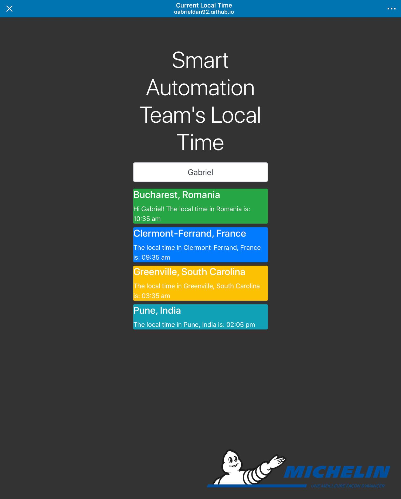

# Local-Time

##### The fully functional website is currently hosted on Github's Pages platform, and can be found <a href="https://gabrieldan92.github.io/Local-TimeZone/" target="_blank">here</a>.
<b>July 2020 update</b><br>
7 months after the initial release, I've implemented a new functionality for retrieving the local time using API calls, a more fail proof solution than using ```moments.js``` to add or substract hours from user's computer time. <a href="http://worldtimeapi.org/">World Time API</a> is a free API service that does the trick for project's current scope.<p>
<a></a>
